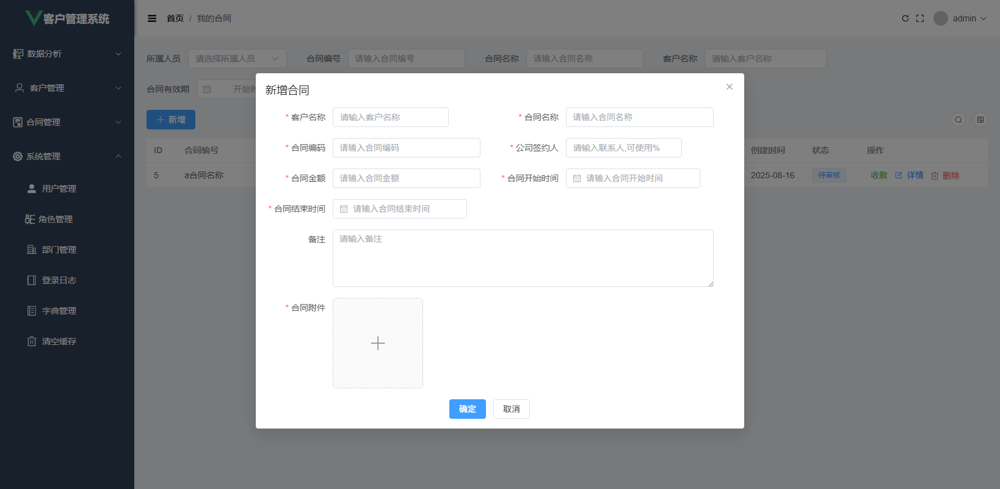

# ak-customer-manage AK客户关系管理系统

AK客户关系管理系统是一款以客户为中心，专门为企业销售团队量身定制的工具，其核心目标是帮助企业实现客户信息集中化、业务流程自动化、数据分析智能化，从而提升客户满意度、增强客户忠诚度，最终驱动业务增长。

## 演示地址

https://337547038.github.io/ak-customer/

## 功能模块列表

- 数据分析：客户级别分析、客户来源分析、客户行业、客户区域、员工客户量、跟进分析、合同排行分析

- 客户管理：客户查重、客户列表、客户联系人、跟进记录、公海客户、无效客户、名片识别、共享客户

- 合同管理：合同管理、回款管理

- 系统管理：用户管理、角色管理、部门管理、登录日志、字典管理


## 目录结构说明

```text
db 数据库文件
demo 编译生成的jar包文件
docs 前端编译生成的项目文件，用于部署前端
src
 ├─main java开发主文件
 └─test
web 前端vue3项目文件
```

## 本地快速启动

1、环境要求：

```text
`jdk21`、`mysql8`、`maven3.8+`、`nodejs22.17+`
```

2、前端启动：

进入`web`目录，首次启动需安装依赖如`pnpm install`。安装完成后启动项目`pnpm run dev`。

3、后端启动：

- 3.1 请使用`IntelliJ IDEA 2025`打开java工程，自动安装依赖

- 3.2 创建数据库并导入目录`db/akcustomer.sql`文件

- 3.3 找到项目`src/main/resources/application.properties`修改数据库相关信息

```text
spring.datasource.url=jdbc:mysql://localhost:3306/akcustomer
spring.datasource.username=root
spring.datasource.password=
spring.datasource.driver-class-name=com.mysql.cj.jdbc.Driver
```

**温馨提示：因目前项目没有完全开源，当前仓库代码运行不起来。但可在本地预览**

**前端请使用`pnpm run preview`启动项目，并使用`http://192.168.xxx.xx`IP地址访问，使用`localhost`会访问请求本地json模拟数据**

**后端按上面要求配置好数据库，进入`demo`目录运行`customer-0.0.1-SNAPSHOT.jar`即可**

```bash
java -jar customer-0.0.1-SNAPSHOT.jar
```

即可正常在本地调试，源码部分目前有偿提供，如有需要可加微信`337547038`

## 相关视频

暂无视频

## 项目截图PC端

|                          |                |
|-------------------------------------------------------|-----------------------------------------------------|
|                  |        |
|        |    |
|                      |      |
|                    |                  |
|          |  |
|  |    |
|      |                      |
|                              |                          |

## 项目截图WAP端
|    |       |
|-------------------------------------|--------------------------------|
|　|　|
|||
|||
|||
|||
|||
|||
|||
|||
